# Bitrix Test Task — Bitrix24 + Bitrix (БУС)

Данный репозиторий содержит решение тестового задания в двух частях:

1. **Bitrix24 (вебхуки, PHP-эндпойнты)** — создание 5 контактов и 15 сделок + JSON-выдача по контактам.
2. **Битрикс управление сайтом (БУС)** — компонент со списком новостей и формой фильтра (поиск, COST, период) с поддержкой AJAX.

> Все шаги ниже воспроизводимы на чистой установке. Скриншоты лежат в `docs/`

---

## TL;DR (быстрый старт)

```txt
# Структура репозитория
b24/                # PHP-скрипты под вебхук Bitrix24
bus/                # Компонент для БУС + пример страницы
docs/               # Скриншоты
```

---

## Требования

- PHP 7.4+ (рекомендовано) с расширением **cURL** и доступом в интернет (для Bitrix24).
- Доступ администратора в Bitrix24 (для создания входящего вебхука).
- Рабочая инсталляция **БУС** (VMBitrix / BitrixEnv / хостинг).

---

## Часть 1. Bitrix24 — вебхуки и PHP-скрипты

Папка: [`b24/`](./b24)

### 1) Создать входящий вебхук

- В портале **Приложения → Разработчикам → Другое → Входящий вебхук**.
- **Настройка прав:** поставьте **CRM**.
- Сохранить базовый URL (формат):  
  `https://<ваш_портал>.bitrix24.ru/rest/<USER_ID>/<TOKEN>/`

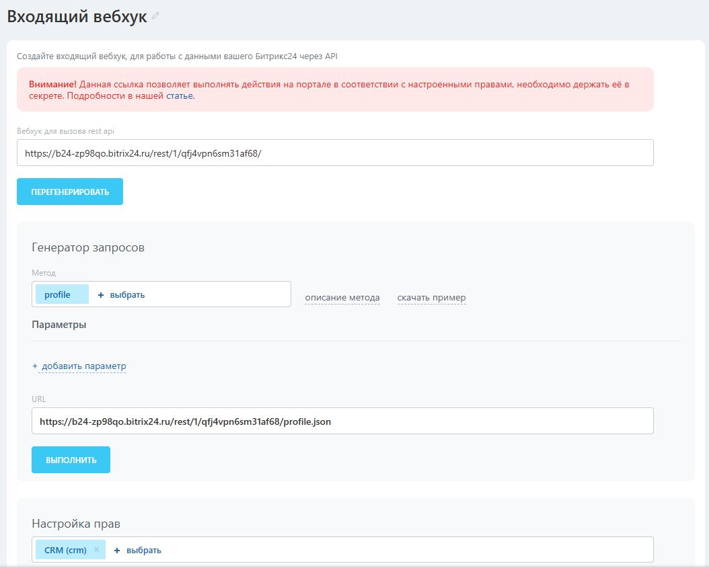

### 2) Запуск

- Создать тест‑данные (5 контактов + 15 сделок):
  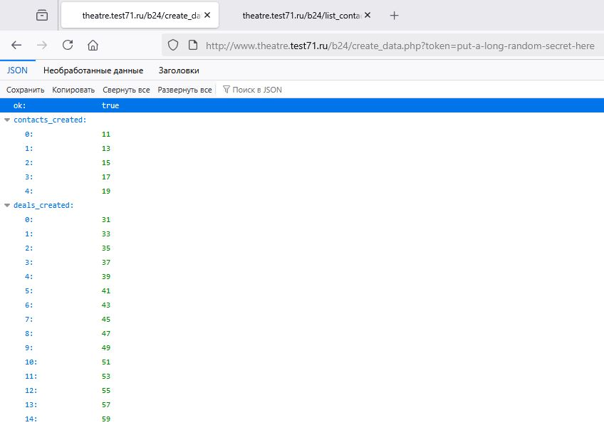

- Выдать JSON по контактам (ФИО, телефон, почта, кол‑во сделок, их ID):
  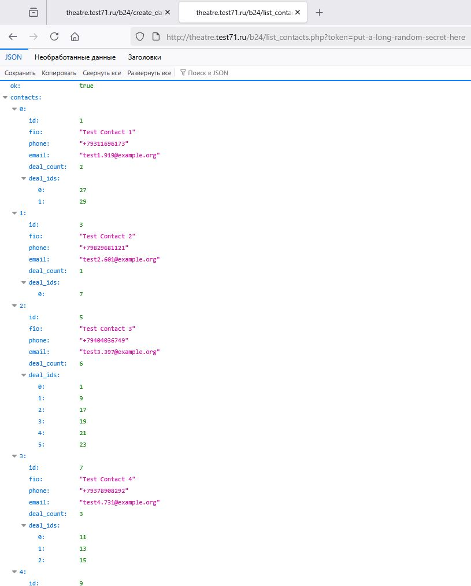

---

## Часть 2. БУС — компонент «список новостей с фильтром»

Папка: [`bus/`](./bus)

### 1) Инфоблок «Новости»

1. Создайте **тип** инфоблока `news` (Название — «Новости»).  
2. Создайте **инфоблок** «Новости» (код `news`), привяжите к сайту `s1`.  
3. Добавьте **свойства**:  
   - `COST` — тип **Число** (Название «Стоимость»). 
   - `FEATURE` — тип **Строка** (Название «Особенность»).
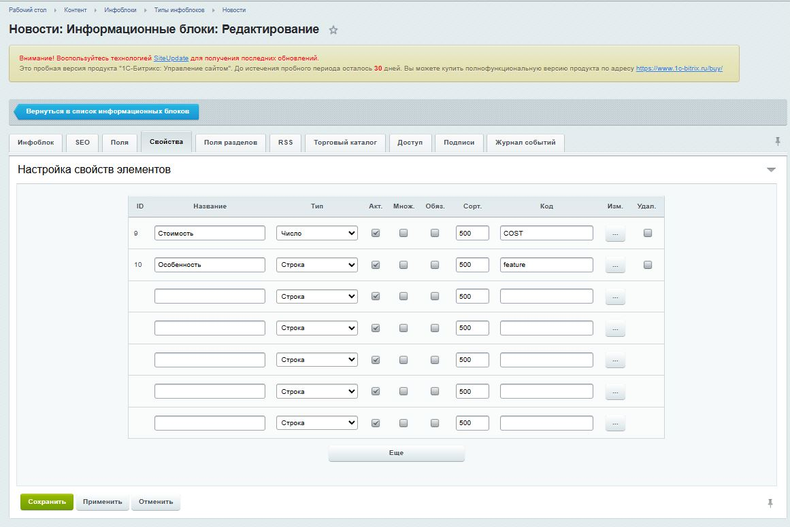
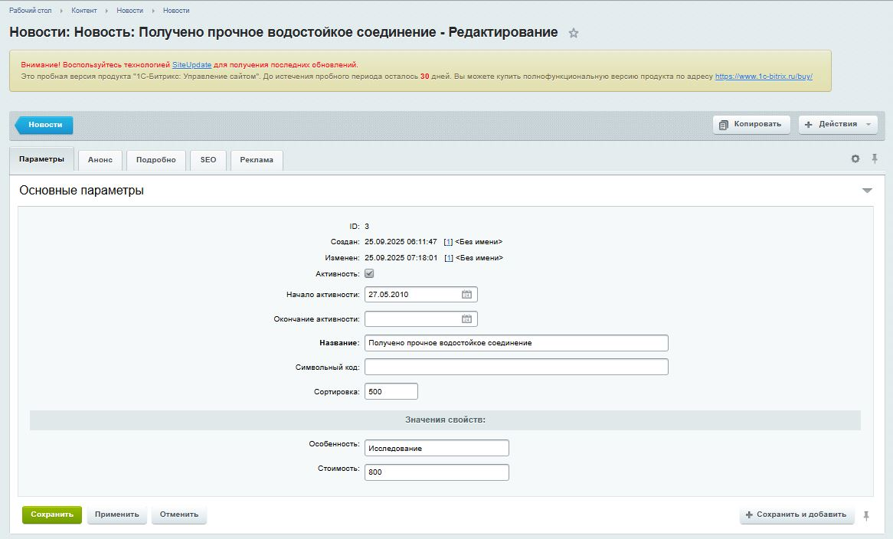
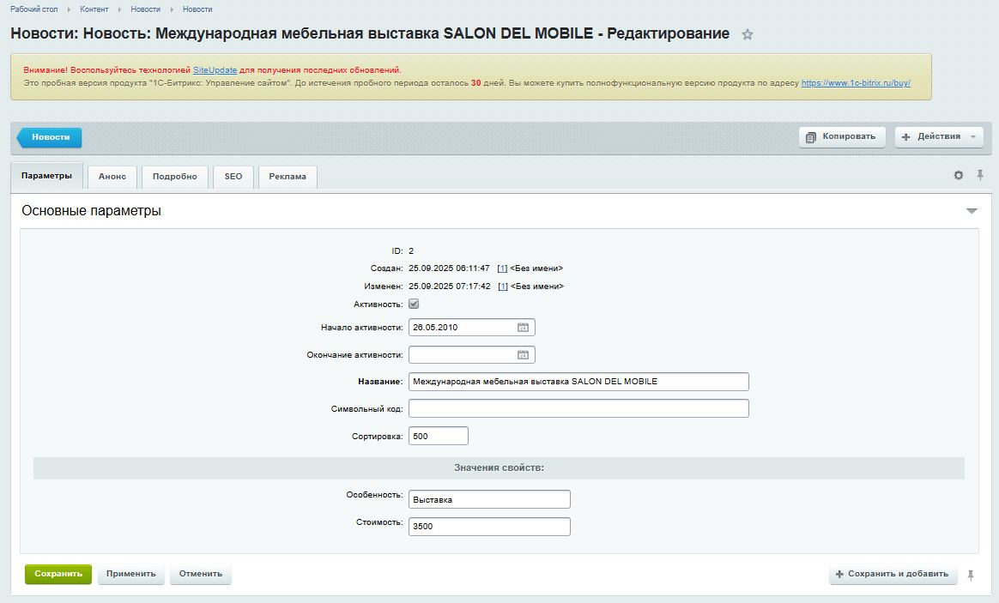
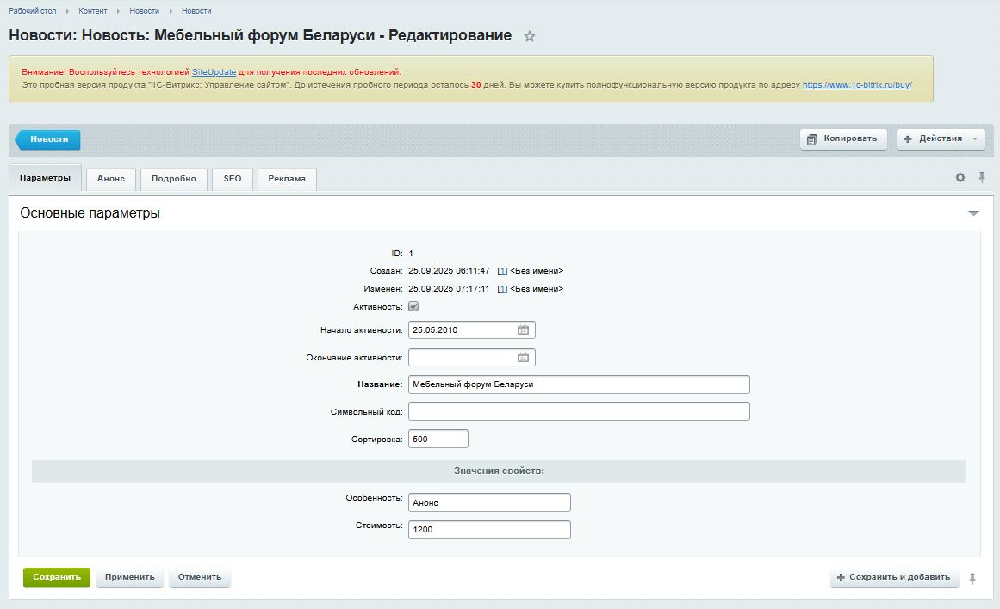
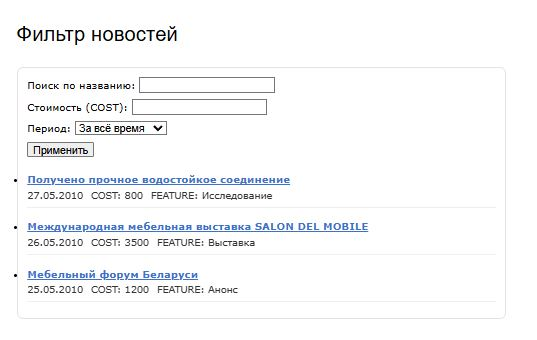
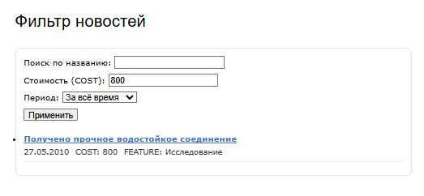
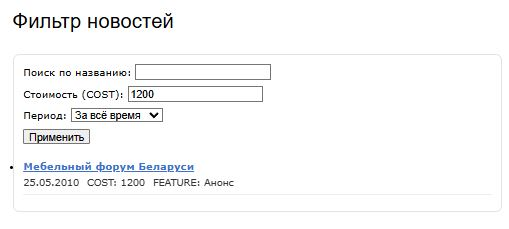
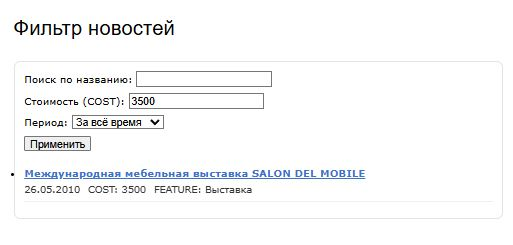
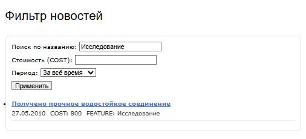
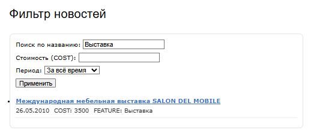
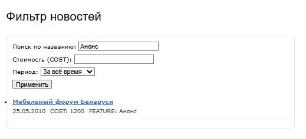

### 4) Что умеет компонент

- Поля формы:
  - **Поиск по названию** — `LIKE` по `NAME` (подстрока).
  - **Стоимость (COST)** — точное совпадение `=PROPERTY_COST` (можно заменить на диапазон).
  - **Период** — `За всё время / За этот месяц / За эту неделю` по `DATE_ACTIVE_FROM`.
- AJAX‑перерисовка включается параметрами компонента (`AJAX_MODE => 'Y'`).
- Сортировка: `DATE_ACTIVE_FROM DESC, ID DESC`.
- Вывод: `NAME`, `DATE_ACTIVE_FROM`, `COST`, `FEATURE`, `DETAIL_PAGE_URL` (если есть).
